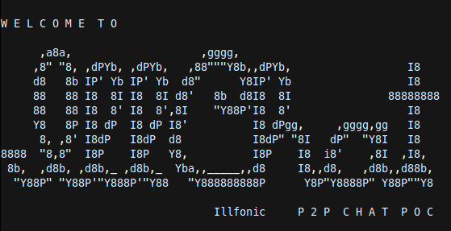

# IllChat

### A terminal-based P2P chat application using libp2p and Golang that uses a Kademlia DHT and the IPFS network for peer discovery and routing

**Version: v0.1.0-alpha**  
**Platform: Windows, Mac OSX and Linux**  
**Language: Go >= 1.16**   

## Overview
The application was inspired by chat examples found on **libp2p**'s pubsub library, but is more evolved and fully featured version of it.   
It uses a [*Kademlia DHT*](./docs/Kademlia.md) from [**libp2p**](#libp2p) for peer discovery and routing and supports a more fully featured host. The other components of the **libp2p** such as *TLS* encryption, peer active discovery, *YAMUX* stream multiplexing are integrated as well. 

The application also allows users to jump between different chat rooms without having to restart the application and they can also change their usernames at any point.

The application works for two nodes on the same network or on different networks. Nodes that are behind *NAT*s on private network are able to communicate with each other because the application attempts to configure the router automatically using *UPnP* and also uses *AutoRelay* (TURN) to facilitate the connection between private nodes by discovering relay nodes and connecting to them.

Communcation between nodes on different private networks is working from *v0.1.0-alpha*.

## Dependancies
### {#libp2p}
**libp2p** is a modular networking stack library born out of The **IPFS Project**.   
**IllChat**'s P2P and GossipSub layers are built using the Go implementation of **libp2p**.

[**go-libp2p Repository**](https://github.com/libp2p/go-libp2p)  
[**libp2p Documentation**](https://docs.libp2p.io/)  

### tview
**tview** is terminal UI library written in Golang with a collection of rich, interactive widgets.   
**IllChat**'s UI layer is built using **tview** and **tcell**.

[**tview Repository**](https://github.com/rivo/tview)  
[**tcell Repository**](https://github.com/gdamore/tcell)  

## Installation
The **IllChat** applcation can be installed by following these steps: 
 
**CLONE THIS REPO**

```bash
$ git clone https://[repository.domain]/illchat_v1.git 
$ cd illchat
```

- Run the install command on a linux based shell (Git Bash for Windows)


```bash
$ make install
```

- The application is now installed and can be invoked anywhere in the system.


```bash
$ illchat
```

- Alternatively, the application can be simply started using


```bash
$ go run .
```

## Usage
When the **IllChat** application is invoked without any flags, it joins the *ill_lobby* chat room as a user named *ill_testuser*. This can be modified by passing the ``-user`` and ``-room`` flags.

The following starts the application and joins the *hang-out* chat room as a user named *Boognish*.
```
illchat -user Boognish -room hang-out
```

The method of peer discovery method can be modified using the ``-discover`` flag. Valid values are *announce* and *advertise*. The application defaults to *advertise*, and generally this would be how all host/peers would initiate. This value should only changed if peer connections aren't being established with the default method, and we would likely never allow a user to set this flag, rather, it would be automated with a connection algorithm. 

The loglevel for the application startup runtime can be modified using the ``-log`` flag. Valid values are *trace*, *debug*, *info*, *warn*, *error*, *fatal* and *panic*. The application defaults to *info*.


## Future Development Tragectory (Fall 2023 / Winter 2024)
- Integrated HQ, low bandwidth audio functionality for realtime multiparty voice communications
- Support for WebSocket transport layers for external notification channels
- Refactor to use `Protobuf` instead of `JSON` for message encoding
- Notifications for Illfonic backend system events; user joins, leaves, mutes, etc.
- Support for other PubSub routers (RandomSub, FloodSub or EpiSub)
- Integration wrappers for Unreal Engine 4/5 UNetDrivers with `goc`

